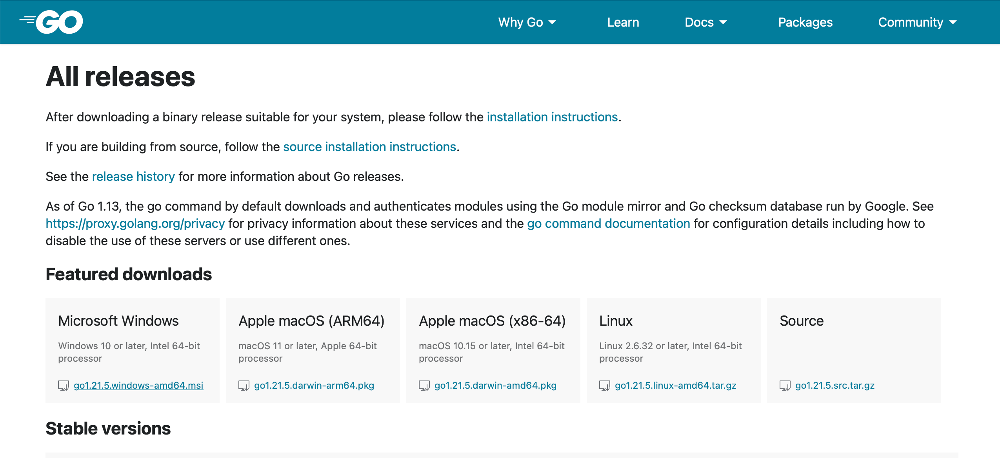

# 2023-2024秋冬 软件工程管理 后端

## 如何使用

### 下载go

去https://go.dev/dl/下载go的二进制文件包，如果是Windows操作系统需要把go添加到环境变量



go环境变量添加参考https://blog.csdn.net/liu_chen_yang/article/details/132012969

### 打开Go Module

```bash
$ go env -w GO111MODULE=on
```

### 然后编译本项目

Windows：

```bash
$ go mod tidy
# 等待依赖下载完...
$ go run ./
```

macOS：

```bash
$ go mod tidy
# 等待依赖下载完...
$ go run *.go
```

